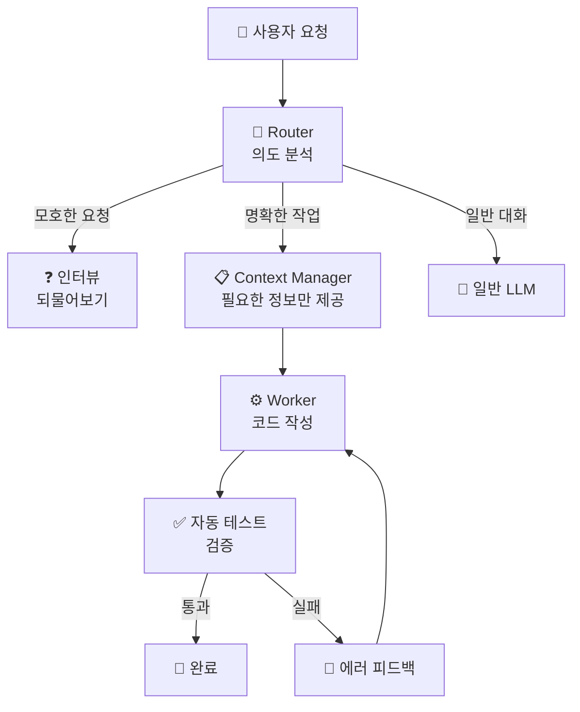

## 이 페이지는?

**Harness Engineering** 영상의 핵심 내용을 정리한 보충 자료입니다.

영상에서 다룬 하네스 엔지니어링의 개념, 4가지 기둥, 그리고 **실제 시스템이 어떻게 작동하는지 의사코드(pseudo-code)**로 확인할 수 있습니다.

---

## 한 줄 요약

<aside>
💡

**AI 에이전트가 실수했을 때, 프롬프트를 고치지 마세요. 마구(harness)를 고치세요.**

그 실패가 구조적으로 반복 불가능하도록 시스템을 바꾸는 것 — 그게 하네스 엔지니어링입니다.

</aside>

---

## AI 활용 방법론의 4가지 축

AI를 활용하는 방법론은 4가지 축으로 나뉩니다. 순서대로 졸업하는 게 아니라 **전부 다 필요한 상호보완적인 축**이에요.

| **축** | **핵심** | **비유** |
| --- | --- | --- |
| Prompt Engineering | AI에게 말을 잘 거는 기술 | 주문을 정확하게 하기 |
| Context Engineering | AI에게 필요한 정보를 적절히 제공하는 기술 | 재료를 잘 골라주기 |
| **Harness Engineering** ⭐ | AI가 실수할 수 없는 환경을 만드는 기술 | 말에게 마구를 씌우기 |
| Agentic Engineering | AI 에이전트를 설계하고 조율하는 기술 | 말을 교배하고 훈련시키기 |

---

## 🐴 말(Horse) 비유로 이해하기

AI 에이전트를 거대한 **짐말(draft horse)**이라고 생각해 보세요.

<aside>
🏋️

**에이전틱 엔지니어링 = 말 훈련**

추론 루프 설계, 멀티 에이전트 조율, 도구 사용법 교육 → 말 자체를 더 강하게 만드는 것

</aside>

<aside>
🔧

**하네스 엔지니어링 = 마구 제작**

가죽 끈, 고삐, 수레를 만드는 것 → 말이 밭을 갈 수 있도록 방향과 한계를 정해주는 장비

</aside>

<aside>
⚡

**말을 아무리 잘 훈련시켜도, 마구 없이는 밭을 갈 수 없습니다.**

</aside>

---

## 하네스 엔지니어링의 4가지 기둥

### 기둥 1: 기계가 읽는 컨텍스트 파일

`CLAUDE.md`, `AGENTS.md`, `.cursorrules` 같은 파일들은 단순한 문서가 아니라 **AI가 실행하는 런타임 설정 파일**입니다.

<aside>
📄

**예시:** [CLAUDE.md](http://CLAUDE.md)에 "새로운 라이브러리를 도입하지 마. DB 쿼리는 반드시 ORM을 통해서만 해."라고 쓰면, AI 에이전트는 이 규칙을 **자신의 행동 제약**으로 인식합니다. 매번 프롬프트에 반복할 필요가 없어요.

</aside>

### 기둥 2: 결정론적 CI/CD 게이트

코드 린터, 구조 테스트, pre-commit hook 등을 통해 규칙을 **시스템이 자동으로 강제**합니다.

- **린터(Linter)** — 코드가 규칙을 어기면 자동으로 에러를 띄움
- **구조 테스트** — 의존성 규칙을 테스트로 강제
- **Pre-commit Hook** — 코드를 커밋하기 전에 자동으로 검사

<aside>
🔑

**핵심:** CI가 실패하면 에이전트가 **스스로 수정**합니다. 사람이 개입하지 않아도 돼요.

</aside>

### 기둥 3: 명시적 도구 경계

AI 에이전트가 **어떤 도구를 쓸 수 있고, 어디까지 접근할 수 있는지**를 명확하게 제한합니다.

- 파일 시스템: `src/` 읽기·쓰기 가능, `config/` 읽기만 가능
- API: 내부 API 호출 가능, 외부 서비스 호출 불가
- 데이터베이스: `SELECT` 가능, `DROP TABLE` 절대 불가

> 프롬프트는 **부탁**이고, 도구 경계는 **물리적 차단**입니다.
> 

### 기둥 4: 지속적 피드백 루프

AI가 만든 코드를 주기적으로 점검하고 품질이 떨어지는 부분을 자동으로 감지·정리하는 시스템입니다.

- 코딩 규칙 위반 자동 감지
- 중복 코드 발견 및 리팩토링 PR 자동 생성
- 사용하지 않는 코드 자동 제거

<aside>
🔄

에이전트가 실수할 때마다, 그 실수는 **새로운 규칙**이 됩니다. 린터 규칙이 추가되고, 테스트가 추가되고, 제약이 추가됩니다. **마구가 점점 더 정교해지는 거예요.**

</aside>

---

## 코드로 보는 하네스 엔지니어링 (Pseudo-Code)

<aside>
🧠

AI를 단순한 챗봇이 아니라 **'능력은 뛰어나지만 신뢰할 수 없는 함수'**로 생각하고, 엄격한 가드레일(제어 장치)로 감싸야 합니다.

하네스는 세 가지 핵심 역할을 합니다:

1. AI가 볼 수 있는 것을 제한 → **컨텍스트 관리**
2. AI가 해야 할 일을 통제 → **라우팅**
3. 작업이 완료될 때까지 AI가 멈추지 못하게 강제 → **실행 루프**
</aside>

---

### 1단계: `router.ts` — 게이트웨이 (고삐의 방향 전환)

사용자의 입력을 LLM에 곧바로 보내는 대신, **라우터가 먼저 가로채서** 단순 대화인지, 엄격히 통제된 워크플로우를 트리거해야 하는지 결정합니다.

```tsx
// router.ts
import { runHarnessLoop } from './harness_loop';
import { extractIntent } from './llm_utils';

function handleUserInput(userPrompt: string) {
    // 1. 프롬프트의 의도를 먼저 분석합니다.
    const intent = extractIntent(userPrompt);

    // 2. 요구사항이 모호하다면, 소크라테스식 인터뷰 하네스를 트리거
    //    → AI가 잘못된 요구사항으로 코드를 환각하는 것을 방지
    if (intent.isAmbiguous) {
        return triggerDeepInterview(userPrompt);
    }

    // 3. 명확하고 실행 가능한 작업이면, 실행 하네스로 라우팅
    if (intent.isActionable) {
        const constraints = buildConstraints(intent);
        // 일반 LLM 호출 대신 지속적인(persistent) 루프에 작업을 넘김
        return runHarnessLoop(userPrompt, constraints);
    }

    // 그 외의 경우 일반 채팅으로 폴백
    return sendToStandardLLM(userPrompt);
}
```

<aside>
💬

**핵심 포인트:** 모호한 요청은 되물어보고, 명확한 작업만 하네스 루프로 보냅니다. 엉뚱한 방향으로 달려가는 걸 **출발 전에** 막는 겁니다.

</aside>

---

### 2단계: `context_manager.ts` — 가림막 (점진적 공개)

아무런 제어 없는 LLM은 전체 코드베이스를 읽고 정작 중요한 제약 사항은 잊어버립니다. **현재 AI에게 정확히 필요한 정보만 제공**합니다.

```tsx
// context_manager.ts
class ProjectMemory {
    
    function getRelevantContext(currentTask: string) {
        let activeContext = [];

        // 1. 전역 제약 조건은 항상 고정(pin)
        //    예: "사용자 로그인 기능 구현 금지"
        activeContext.push(this.getGlobalConstraints());

        // 2. 현재 하위 작업과 직접 관련된 파일만 가져옴
        const hotFiles = vectorSearchCodebase(currentTask);
        activeContext.push(hotFiles);

        // 3. 메모리 압축: 이미 완료된 과거 코드는 제거
        this.runGarbageCollection();

        return activeContext;
    }
    
    function runGarbageCollection() {
        // 컨텍스트 윈도우가 꽉 차면,
        // 이전 단계들을 요약하고 관련 없는 파일들을 버림
    }
}
```

<aside>
💬

**핵심 포인트:** 말에게 밭 전체가 아니라, **지금 갈아야 할 이랑만** 보여주는 것과 같습니다.

</aside>

---

### 3단계: `harness_loop.ts` — 엔진 (자동 교정 장치) ⭐

이곳이 **하네스의 심장부**입니다. AI를 `계획 → 실행 → 검증 → 수정` 루프에 강제로 밀어넣는 상태 머신입니다. **테스트를 통과하기 전까지 AI는 이 함수를 빠져나갈 수 없습니다.**

```tsx
// harness_loop.ts
import { callIsolatedLLMWorker } from './worker';
import { ProjectMemory } from './context_manager';

function runHarnessLoop(task: string, constraints: string[]) {
    let memory = new ProjectMemory();
    let isTaskComplete = false;
    let attemptCount = 0;
    const MAX_ATTEMPTS = 5;

    // 지속적 실행 루프 (Persistent Execution Loop)
    while (!isTaskComplete && attemptCount < MAX_ATTEMPTS) {
        
        // 1. 엄격하게 범위가 지정된 컨텍스트를 가져옴
        let context = memory.getRelevantContext(task);
        
        // 2. 실행: LLM이 코드를 작성
        //    날것의 프롬프트가 아니라, 컨텍스트와 제약 조건을 함께 전달
        let generatedCode = callIsolatedLLMWorker(
            "WRITE_CODE", task, context, constraints
        );
        
        // 3. 검증: LLM을 믿지 마세요. 실제 테스트를 돌림
        let verificationResult = runAutomatedTests(generatedCode);

        // 4. 평가 및 수정
        if (verificationResult.passed) {
            isTaskComplete = true;
            console.log("작업이 완료되고 검증되었습니다.");
            return generatedCode;
        } else {
            // 하네스의 마법: 에러를 AI에게 다시 피드백으로 던짐
            console.log("검증 실패. AI를 수정 루프에 집어넣습니다...");
            
            // 특정 에러를 고치는 데만 집중하도록 작업을 업데이트
            task = `코드가 다음 에러를 발생시켰습니다: 
                ${verificationResult.errorTrace}. 수정하세요.`;
            attemptCount++;
        }
    }

    throw new Error(
        "하네스 중단: AI가 제한된 시도 횟수 내에 문제를 해결하지 못했습니다."
    );
}
```

<aside>
⚡

**이것이 하네스의 핵심입니다!**

AI가 코드를 작성하면 자동으로 테스트를 돌리고, 실패하면 에러 메시지를 AI에게 다시 던져서 수정하게 합니다. **사용자가 결과를 보기도 전에, AI가 스스로 오류를 수정하는 구조**입니다.

</aside>

---

### 4단계: `worker.ts` — 실행부 (역할 분리)

워커는 실제 LLM을 호출하는 부분입니다. 코드를 **작성하는 워커**와 **리뷰하는 워커**를 완전히 분리하여 컨텍스트 오염을 방지합니다.

```tsx
// worker.ts
function callIsolatedLLMWorker(
    role: string, task: string, 
    context: string, constraints: string[]
) {
    // 역할에 맞는 시스템 프롬프트를 구성
    let systemPrompt = "";
    if (role === "WRITE_CODE") {
        systemPrompt = "당신은 전문 실행 에이전트입니다. "
            + "코드를 작성하세요. 설명하지 마세요. "
            + "마크다운을 쓰지 마세요. 순수한 코드만 출력하세요.";
    } else if (role === "SECURITY_REVIEW") {
        systemPrompt = "당신은 보안 감사관입니다. "
            + "취약점을 찾으세요. 기능 코드를 작성하지 마세요.";
    }

    // 엄격한 경계를 두고 LLM API를 호출
    const response = llmApi.generate({
        system: systemPrompt,
        user_message: `작업: ${task}\n제약조건: ${constraints}`,
        context_data: context,
        temperature: 0.0  // 일관된 결과를 위해 0으로 유지
    });

    return response;
}
```

<aside>
💬

**핵심 포인트:** 같은 사람이 쓰고 검토하면 실수를 못 잡듯이, AI도 역할을 나눠야 품질이 올라갑니다.

</aside>

---

## 전체 흐름 요약



---

## 실제 사례 — OpenAI, 3명이 5개월

2026년 2월, OpenAI는 **3명의 엔지니어가 코드를 한 줄도 직접 쓰지 않고** AI 에이전트만으로 대규모 소프트웨어 제품을 만든 사례를 발표했습니다.

| **하네스 기둥** | **OpenAI 팀이 실제로 한 일** |
| --- | --- |
| 컨텍스트 파일 | [AGENTS.md](http://AGENTS.md) 작성 — AI에게 줄 지침서 설계 |
| CI/CD 게이트 | Lint, 테스트, Hook으로 자동 검증 파이프라인 구축 |
| 도구 경계 | AI 에이전트의 접근 범위와 권한 설정 |
| 피드백 루프 | AI가 만든 결과를 리뷰하고, 규칙을 계속 보강 |

> **"인간은 조종한다(steer). 에이전트는 실행한다(execute)."** — OpenAI
> 

---

## 개발자 역할의 진화

| **축** | **역할** | **비유** |
| --- | --- | --- |
| Prompt | 프롬프트 엔지니어 | AI에게 의도를 정확히 전달하는 사람 |
| Context | 컨텍스트 아키텍트 | AI가 참조할 지식 체계를 설계하는 사람 |
| **Harness** | **플랫폼 엔지니어** | **AI가 실수할 수 없는 환경을 만드는 사람** |
| Agentic | 에이전트 오케스트레이터 | AI 에이전트를 설계하고 조율하는 사람 |

<aside>
🚀

**AI 시대에 우리의 역할은 축소되는 게 아니라, 상향 이동하는 것입니다.**

직접 공을 차는 선수에서, 전술을 짜고 팀을 운영하는 감독으로 올라가는 겁니다.

</aside>

---

## 오늘의 핵심 한 줄

<aside>
🎯

**AI 에이전트가 실수했을 때, 프롬프트를 고치지 마세요. 마구를 고치세요.**

그 실패가 구조적으로 반복 불가능하도록 시스템을 바꾸세요. 그게 하네스 엔지니어링입니다.

</aside>

---

*📺 에이전틱엔지니어링 채널 EP03 — 하네스 엔지니어링, 왜 지금 모두가 주목하는가*

*참고: Anthropic, Martin Fowler, Addy Osmani, Andrej Karpathy, OpenAI 등 최신 레퍼런스 기반*